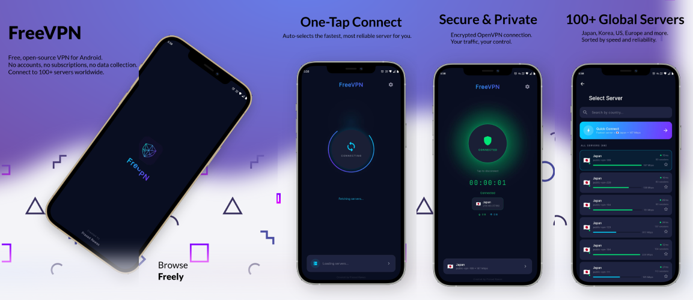
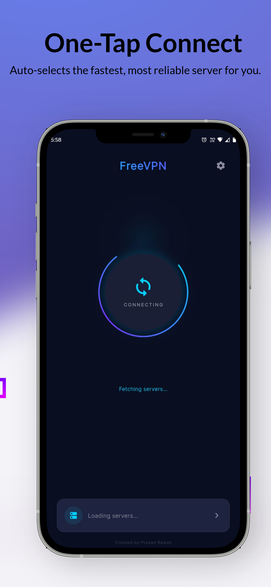
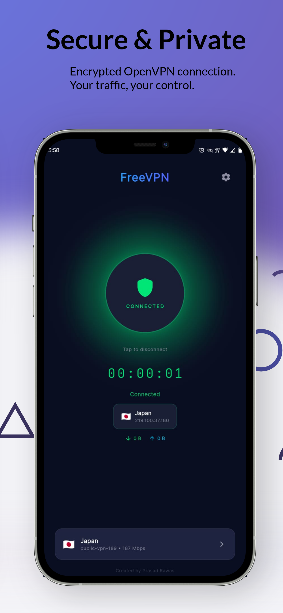
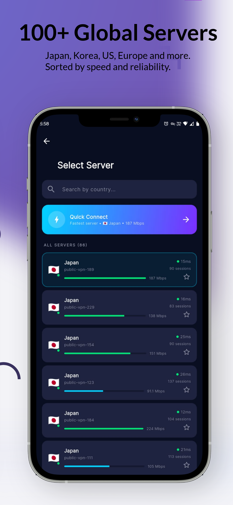

# FreeVPN

A free, open-source VPN client for Android built with Flutter. Connects to [VPN Gate](https://www.vpngate.net/) public relay servers using OpenVPN.



## Features

- One-tap auto-connect to the best available server
- Real-time download/upload speed display
- Connection quality indicator (Good/Fair/Poor)
- Country filter on server list
- Recently connected servers (last 5)
- Signal strength bars for server speed
- Server list sorted by reliability score, speed, and ping
- Seamless server switching without manual disconnect
- Favorite servers
- Data usage tracking (daily/weekly/monthly)
- Connection timer with state persistence across app kills
- Background server list refresh every 5 minutes
- Reconnect loop detection with automatic server failover
- Offline server warnings
- Battery optimization prompt for Xiaomi/Huawei/Oppo/Vivo
- ISP DNS bypass for blocked networks (Jio, Vi, Airtel)
- Persistent VPN notification with server name and stop button
- Privacy policy, terms of service, VPN disclaimer (WebView)
- Firebase Crashlytics and Analytics
- 115+ unit tests

## Screenshots

| Intro | Splash | Connecting | Connected | Server List |
|:---:|:---:|:---:|:---:|:---:|
|  |  |  |  |  |

## Requirements

- Flutter 3.12+
- Android SDK with CMake 3.22.1
- JDK 17

## Setup

```bash
flutter pub get
flutter run
```

## How It Works

The app fetches free VPN servers from the [VPN Gate API](https://www.vpngate.net/api/iphone/), filters out unreliable ones (low speed, no sessions, no ping), and connects using the `openvpn_flutter` plugin.

OpenVPN configs from VPN Gate are sanitized at connect time — stripping 21 dangerous/incompatible directives and injecting cipher negotiation for compatibility with the bundled OpenVPN library. ISP DNS blocking is bypassed via direct IP fallback with SSL certificate validation.

## Tech Stack

- **Flutter** with Provider for state management
- **openvpn_flutter** for VPN tunnel
- **Dio** for API requests with retry and ISP bypass
- **Firebase Crashlytics & Analytics** for crash reporting and usage insights
- **SharedPreferences** for connection state, favorites, recent servers, and data usage
- **WebView** for legal pages (loaded from website)
- **package_info_plus** for dynamic version display

## Deployment

### Debug Build

```bash
flutter run
```

### Release APK (for sharing)

```bash
flutter build apk --release
```

Output: `build/app/outputs/flutter-apk/app-release.apk`

### Release AAB (for Play Store)

```bash
flutter build appbundle --release
```

Output: `build/app/outputs/bundle/release/app-release.aab`

### Signing Setup

1. Generate a keystore:
   ```bash
   keytool -genkey -v -keystore ~/freevpn-release.jks -keyalg RSA -keysize 2048 -validity 10000 -alias freevpn
   ```

2. Create `android/key.properties` (do not commit this file):
   ```properties
   storePassword=YOUR_PASSWORD
   keyPassword=YOUR_PASSWORD
   keyAlias=freevpn
   storeFile=/path/to/freevpn-release.jks
   ```

3. The `build.gradle.kts` automatically picks up `key.properties` for release builds. If the file is missing, it falls back to debug signing.

### Firebase Setup

1. Create a Firebase project at [console.firebase.google.com](https://console.firebase.google.com)
2. Add an Android app with package name `com.prasadrawas.freevpn`
3. Download `google-services.json` and place it at `android/app/google-services.json`
4. Crashlytics and Analytics are pre-configured — no additional code changes needed

### Website Deployment (GitHub Pages)

The landing page is served from the `docs/` folder via GitHub Pages.

1. Make changes to files in `docs/`
2. Commit and push to `main`
3. GitHub Pages auto-deploys from `docs/` on `main` branch
4. Custom domain: `freevpn.prasadrawas.online` (configured via `docs/CNAME`)

```
docs/
  index.html              # Landing page
  sitemap.xml             # SEO sitemap
  robots.txt              # Crawler directives
  CNAME                   # Custom domain
  assets/
    app_icon.png          # App icon
    style.css             # Styles
    script.js             # Animations
    og-image.png          # Social media preview
  legal/
    privacy.html          # Privacy policy
    terms.html            # Terms of service
    disclaimer.html       # VPN disclaimer
```

### Running Tests

```bash
flutter test              # Run all tests
flutter test test/models/ # Run model tests only
flutter test test/services/ # Run service tests only
flutter test test/providers/ # Run provider tests only
```

## Privacy & Legal

- [Privacy Policy](https://freevpn.prasadrawas.online/legal/privacy.html)
- [Terms of Service](https://freevpn.prasadrawas.online/legal/terms.html)
- [VPN Disclaimer](https://freevpn.prasadrawas.online/legal/disclaimer.html)

## License

This project is open source. Created by **Prasad Rawas**.
